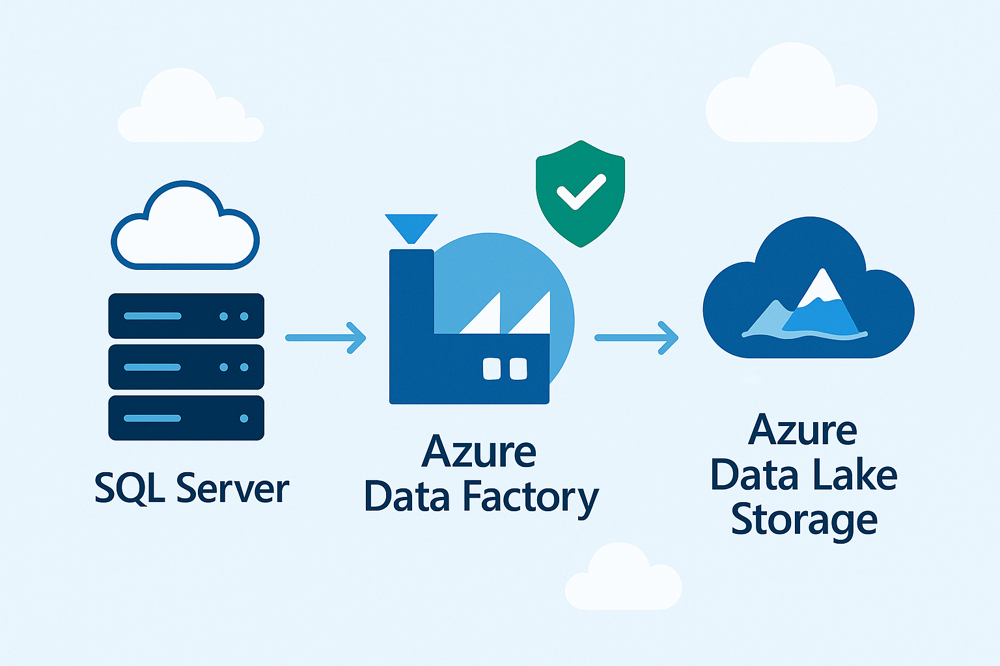
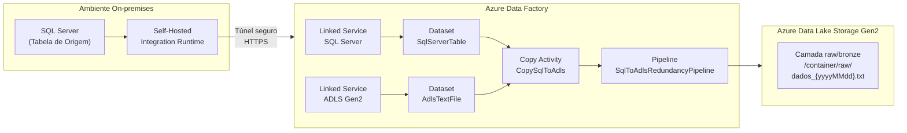
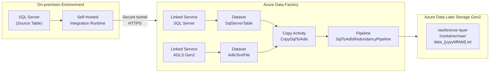

Atividade proposta pela **DIO** dentro do meu programa de aprendizado em **Microsoft AI for Tech - Azure Databricks**

# Criando Processos de Redundância de Arquivos no Microsoft Azure

<div align="center">


</div>




## Introdução

Este projeto documenta a implementação de um processo completo de redundância de arquivos no Microsoft Azure utilizando o Azure Data Factory (ADF). A solução conecta ambientes on-premises com recursos na nuvem Azure, permitindo a movimentação segura e eficiente de dados entre esses ambientes. O foco principal é criar um fluxo automatizado que extrai dados de uma tabela SQL Server on-premises, transfere-os para o Azure Data Lake Storage (ADLS) e os converte em arquivos .TXT organizados em uma estrutura de camadas (raw/bronze).

A redundância de dados é uma prática essencial para garantir a disponibilidade, a segurança e a integridade das informações em ambientes corporativos. Ao implementar este projeto, você estará criando uma solução que não apenas protege os dados contra perdas, mas também facilita sua utilização em diferentes contextos e aplicações na nuvem.

## Objetivo do Projeto

O objetivo principal deste projeto é estabelecer um processo automatizado e confiável para criar redundância de dados entre ambientes on-premises e a nuvem Azure. Especificamente, buscamos:

1. Configurar a infraestrutura necessária no Azure Data Factory para conectar ambientes on-premises e na nuvem
2. Implementar a extração de dados de uma tabela SQL Server local
3. Transferir esses dados para o Azure Data Lake Storage
4. Converter os dados em arquivos .TXT organizados em uma estrutura de camadas
5. Validar, publicar e executar o pipeline de dados
6. Analisar a performance e aplicar boas práticas

Ao final deste projeto, teremos uma solução funcional que pode ser adaptada para diferentes cenários de redundância de dados, contribuindo para estratégias de continuidade de negócios e recuperação de desastres.

## Pré-requisitos

Para implementar este projeto, são necessários os seguintes componentes e conhecimentos:

### Recursos Azure
- Uma assinatura ativa do Microsoft Azure
- Acesso para criar e gerenciar recursos do Azure Data Factory
- Permissão para criar e configurar recursos de armazenamento (Azure Data Lake Storage Gen2)
- Capacidade de criar e gerenciar recursos de banco de dados (Azure SQL Database)

### Ambiente On-premises
- Um servidor SQL Server local com uma tabela de dados para teste
- Permissões administrativas no servidor para configurar o Integration Runtime
- Conectividade de rede entre o ambiente local e o Azure

### Conhecimentos Técnicos
- Familiaridade básica com o portal Azure e seus serviços
- Entendimento de conceitos de bancos de dados SQL
- Noções de ETL (Extract, Transform, Load) e pipelines de dados

## Arquitetura da Solução

A solução implementada neste projeto segue a seguinte arquitetura:

1. **Ambiente On-premises**:
   - SQL Server com tabela de dados de origem
   - Self-hosted Integration Runtime (SHIR) para conectividade segura com o Azure

2. **Microsoft Azure**:
   - Azure Data Factory para orquestração do fluxo de dados
   - Azure SQL Database para armazenamento opcional de dados na nuvem
   - Azure Data Lake Storage Gen2 para armazenamento dos arquivos .TXT

3. **Fluxo de Dados**:
   - Extração de dados da tabela SQL Server on-premises
   - Transferência para o Azure via Integration Runtime
   - Armazenamento e conversão para arquivos .TXT no Data Lake
   - Organização em estrutura de camadas (raw/bronze)

Esta arquitetura proporciona um fluxo seguro e eficiente de dados entre o ambiente local e a nuvem, garantindo a redundância e a disponibilidade das informações.



## Passo a Passo da Implementação

### 1. Configuração do Self-Hosted Integration Runtime (SHIR)

O Self-Hosted Integration Runtime é um componente essencial para conectar o Azure Data Factory a recursos em redes privadas, como servidores SQL on-premises. Ele atua como uma ponte segura entre os ambientes, permitindo a movimentação de dados sem expor diretamente os servidores locais à internet.

Para configurar o SHIR:

1. **Criar o Integration Runtime no Azure Data Factory**:
   - No portal Azure, acesse sua instância do Azure Data Factory
   - Navegue até "Manage" > "Integration Runtimes" > "New"
   - Selecione "Self-Hosted" como tipo de Integration Runtime
   - Forneça um nome descritivo (ex: "OnPremisesIntegrationRuntime")
   - Copie a chave de autenticação gerada

2. **Instalar o Integration Runtime no servidor on-premises**:
   - Baixe o instalador do Integration Runtime no servidor que tem acesso ao SQL Server
   - Execute o instalador e siga o assistente de configuração
   - Quando solicitado, insira a chave de autenticação copiada anteriormente
   - Aguarde a conclusão do registro e a confirmação de que o Integration Runtime está online

3. **Verificar a conectividade**:
   - No portal Azure, confirme que o status do Integration Runtime está como "Running"
   - Teste a conectividade com o SQL Server local usando a opção de diagnóstico

O SHIR agora está configurado e pronto para facilitar a transferência segura de dados entre o ambiente on-premises e o Azure.

### 2. Criação de Linked Services

Os Linked Services no Azure Data Factory funcionam como conexões para fontes de dados e destinos. Neste projeto, precisamos configurar três Linked Services principais:

1. **Linked Service para SQL Server On-premises**:
   - No ADF Studio, navegue até "Manage" > "Linked Services" > "New"
   - Selecione "SQL Server" como tipo
   - Configure os seguintes parâmetros:
     - Nome: "SqlServerOnPremises"
     - Integration Runtime: selecione o SHIR criado anteriormente
     - Nome do servidor: endereço do servidor SQL local
     - Nome do banco de dados: banco que contém a tabela de origem
     - Tipo de autenticação: Windows ou SQL Authentication
     - Credenciais: usuário e senha com permissões adequadas
   - Teste a conexão antes de salvar

2. **Linked Service para Azure SQL Database (opcional)**:
   - Selecione "Azure SQL Database" como tipo
   - Configure os seguintes parâmetros:
     - Nome: "AzureSqlDatabase"
     - Método de seleção: "From Azure subscription"
     - Assinatura Azure: selecione sua assinatura
     - Nome do servidor: selecione ou crie um servidor SQL Azure
     - Nome do banco de dados: selecione ou crie um banco de dados
     - Tipo de autenticação: SQL Authentication
     - Credenciais: usuário e senha do banco Azure
   - Teste a conexão antes de salvar

3. **Linked Service para Azure Data Lake Storage Gen2**:
   - Selecione "Azure Data Lake Storage Gen2" como tipo
   - Configure os seguintes parâmetros:
     - Nome: "AzureDataLakeStorage"
     - Método de seleção: "From Azure subscription"
     - Assinatura Azure: selecione sua assinatura
     - Nome da conta de armazenamento: selecione ou crie uma conta ADLS Gen2
     - Teste a conexão antes de salvar

Estes Linked Services estabelecem as conexões necessárias para o fluxo de dados entre as diferentes fontes e destinos do nosso pipeline.

### 3. Criação de Datasets

Os Datasets no Azure Data Factory representam estruturas de dados dentro das fontes de dados. Para nosso projeto, precisamos criar os seguintes datasets:

1. **Dataset para tabela SQL Server On-premises**:
   - No ADF Studio, navegue até "Author" > "+" > "Dataset"
   - Selecione "SQL Server" como tipo
   - Configure os seguintes parâmetros:
     - Nome: "SqlServerTable"
     - Linked Service: selecione o Linked Service "SqlServerOnPremises"
     - Nome da tabela: selecione a tabela de origem (ex: "dbo.Customers")
   - Visualize os dados para confirmar o acesso correto

2. **Dataset para Azure Data Lake Storage (formato .TXT)**:
   - Selecione "DelimitedText" como tipo
   - Configure os seguintes parâmetros:
     - Nome: "AdlsTextFile"
     - Linked Service: selecione o Linked Service "AzureDataLakeStorage"
     - Caminho do arquivo: especifique o caminho no formato "container/raw/data.txt"
     - Primeira linha como cabeçalho: "True"
     - Delimitador: selecione o delimitador apropriado (ex: vírgula)
   - Defina o esquema conforme necessário

Estes datasets definem as estruturas de dados que serão utilizadas no pipeline de cópia, especificando tanto a origem (tabela SQL) quanto o destino (arquivo .TXT no Data Lake).

### 4. Criação do Pipeline de Cópia

O Pipeline é o componente central do Azure Data Factory, orquestrando o fluxo de dados entre a origem e o destino. Para nosso projeto de redundância, vamos criar um pipeline com uma atividade de cópia:

1. **Criar um novo Pipeline**:
   - No ADF Studio, navegue até "Author" > "+" > "Pipeline"
   - Nomeie o pipeline como "SqlToAdlsRedundancyPipeline"

2. **Adicionar atividade de cópia**:
   - Na caixa de ferramentas, arraste a atividade "Copy data" para o canvas
   - Nomeie a atividade como "CopySqlToAdls"

3. **Configurar a origem**:
   - Na aba "Source", selecione o dataset "SqlServerTable"
   - Se necessário, configure uma consulta SQL personalizada para filtrar os dados

4. **Configurar o destino**:
   - Na aba "Sink", selecione o dataset "AdlsTextFile"
   - Configure as opções de escrita:
     - Opção de cópia: "Add dynamic content" para definir o caminho dinâmico
     - Formato de nome de arquivo: inclua data/hora para versionamento (ex: "data_{yyyy-MM-dd_HH-mm}.txt")

5. **Configurar mapeamentos**:
   - Na aba "Mapping", verifique se as colunas da origem estão corretamente mapeadas para o destino
   - Ajuste tipos de dados conforme necessário

6. **Configurar configurações adicionais**:
   - Na aba "Settings", configure:
     - Tolerância a falhas: defina comportamento em caso de erros
     - Paralelismo: ajuste conforme necessidade de performance
     - Log de atividades: habilite para monitoramento detalhado

7. **Adicionar parâmetros dinâmicos (opcional)**:
   - Configure parâmetros de pipeline para tornar a solução mais flexível
   - Utilize expressões para definir caminhos dinâmicos baseados em data/hora

O pipeline agora está configurado para extrair dados da tabela SQL Server on-premises e transferi-los para o Azure Data Lake Storage como arquivos .TXT, seguindo a estrutura de camadas definida.

### 5. Validação, Publicação e Execução

Após configurar todos os componentes, é hora de validar, publicar e executar o pipeline:

1. **Validar o pipeline**:
   - Clique no botão "Validate" para verificar se há erros de configuração
   - Corrija quaisquer problemas identificados

2. **Publicar as alterações**:
   - Clique no botão "Publish all" para publicar todos os componentes (Linked Services, Datasets, Pipeline)
   - Confirme a publicação e aguarde a conclusão

3. **Executar o pipeline**:
   - Clique em "Add trigger" > "Trigger now" para executar o pipeline manualmente
   - Alternativamente, configure um trigger recorrente:
     - "Add trigger" > "New/Edit" > configure a programação desejada (ex: diariamente às 2h)

4. **Monitorar a execução**:
   - Navegue até a aba "Monitor" para acompanhar o progresso da execução
   - Verifique o status, duração e detalhes de cada atividade
   - Em caso de falhas, analise os logs de erro para identificar e corrigir problemas

5. **Verificar os resultados**:
   - Acesse o Azure Data Lake Storage para confirmar que os arquivos .TXT foram criados corretamente
   - Verifique se a estrutura de pastas (raw/bronze) está conforme o esperado
   - Abra alguns arquivos para confirmar que os dados foram transferidos corretamente

A execução bem-sucedida do pipeline confirma que o processo de redundância está funcionando corretamente, transferindo dados do ambiente on-premises para o Azure de forma segura e organizada.

## Análise de Performance e Boas Práticas

Para garantir que o processo de redundância seja eficiente e escalável, é importante analisar a performance e aplicar boas práticas:

### Análise de Performance

1. **Métricas de execução**:
   - Analise o tempo total de execução do pipeline
   - Verifique a taxa de transferência de dados (MB/s)
   - Identifique possíveis gargalos no processo

2. **Otimização de recursos**:
   - Ajuste o paralelismo da atividade de cópia conforme o volume de dados
   - Configure o tamanho apropriado do Integration Runtime
   - Utilize compressão para reduzir o volume de dados transferidos

### Boas Práticas

1. **Segurança**:
   - Utilize Key Vault para armazenar credenciais e segredos
   - Implemente controle de acesso baseado em funções (RBAC) para recursos Azure
   - Mantenha o Integration Runtime atualizado com as últimas correções de segurança

2. **Monitoramento**:
   - Configure alertas para falhas de pipeline
   - Implemente logs detalhados para diagnóstico
   - Utilize o Azure Monitor para acompanhar métricas de longo prazo

3. **Escalabilidade**:
   - Projete a solução considerando o crescimento futuro do volume de dados
   - Utilize particionamento para lidar com grandes conjuntos de dados
   - Considere a implementação de processamento incremental para reduzir a carga

4. **Recuperação**:
   - Implemente mecanismos de retry para lidar com falhas temporárias
   - Configure checkpoints para permitir a retomada de transferências interrompidas
   - Documente procedimentos de recuperação para diferentes cenários de falha

A aplicação dessas práticas garante que o processo de redundância seja não apenas funcional, mas também robusto, seguro e eficiente.

## Prints (Descrições Visuais Aprimoradas)

Embora capturas de tela reais não possam ser incorporadas diretamente aqui, esta seção aprimorada visa fornecer descrições textuais ainda mais detalhadas, simulando a experiência visual de navegar pelo Portal Azure e pelo ADF Studio durante a configuração:

1.  **Configuração do SHIR (Azure Portal):**
    *   *Descrição Visual:* Imagine a tela "Integration Runtimes" no ADF Studio (aba "Manage"). Uma lista de runtimes existentes é exibida. Clicamos em "+ New". Uma janela lateral surge, mostrando opções como "Azure, Self-Hosted" e "Azure-SSIS". Selecionamos "Self-Hosted" e clicamos "Continue". Na próxima tela, inserimos o nome "OnPremisesIntegrationRuntime" e uma descrição opcional. Clicamos em "Create". Uma nova janela pop-up aparece com duas opções: "Option 1: Express setup" e "Option 2: Manual setup". Abaixo, vemos as "Authentication key 1" e "Authentication key 2" (ofuscadas, com um botão para copiar ao lado). Copiamos a Chave 1.

2.  **Instalação do SHIR (Servidor On-Premises):**
    *   *Descrição Visual:* Visualizamos o assistente de instalação do "Microsoft Integration Runtime" em uma máquina Windows Server. Após aceitar os termos, o instalador copia os arquivos. A tela final é o "Integration Runtime Configuration Manager". Um campo de texto proeminente pede a "Authentication key". Colamos a chave copiada do portal Azure. Clicamos em "Register". Após alguns instantes, uma marca de verificação verde aparece ao lado de "Registration", e o status do nó muda para "Running" e "Connected to cloud service".

3.  **Criação do Linked Service (SQL On-Premises):**
    *   *Descrição Visual:* No ADF Studio (aba "Manage" > "Linked Services"), clicamos em "+ New". Uma grade de ícones de fontes de dados aparece. Digitamos "SQL Server" na busca e selecionamos o ícone correspondente. Clicamos "Continue". Na tela de configuração, preenchemos:
        *   Name: `SqlServerOnPremises`
        *   Description: (Opcional)
        *   Connect via integration runtime: Selecionamos `OnPremisesIntegrationRuntime` na lista suspensa.
        *   Server name: Digitamos o nome ou IP do servidor SQL local (ex: `SRV-SQL-01`).
        *   Database name: Digitamos o nome do banco (ex: `VendasDB`).
        *   Authentication type: Selecionamos "SQL Authentication".
        *   User name: Digitamos o usuário SQL (ex: `adf_user`).
        *   Password: Selecionamos "Azure Key Vault" (idealmente) ou inserimos a senha diretamente.
    *   Clicamos em "Test connection". Após alguns segundos, uma mensagem "Connection successful" aparece em verde. Clicamos em "Create".

4.  **Criação do Dataset (ADLS - TXT):**
    *   *Descrição Visual:* No ADF Studio (aba "Author" > "+" > "Dataset"), selecionamos "Azure Data Lake Storage Gen2" e depois "DelimitedText". Clicamos "Continue". Na tela "Set properties":
        *   Name: `AdlsTextFile`
        *   Linked service: Selecionamos `AzureDataLakeStorage`.
        *   File path: Clicamos em "Browse". Navegamos até o container desejado (ex: `datalake`) e digitamos `raw/` no caminho. Deixamos o nome do arquivo em branco por enquanto (será dinâmico no pipeline).
        *   First row as header: Marcamos a caixa de seleção.
        *   Import schema: Selecionamos "None" (ou "From connection/store" se um arquivo de exemplo existir).
    *   Clicamos em "OK".

5.  **Configuração da Atividade de Cópia (Sink):**
    *   *Descrição Visual:* No canvas do pipeline "SqlToAdlsRedundancyPipeline", selecionamos a atividade "CopySqlToAdls". Na aba "Sink", com o dataset `AdlsTextFile` selecionado, localizamos o campo "File path" dentro das configurações do dataset. Ao lado do campo do nome do arquivo, clicamos em "Add dynamic content [Alt+P]". Uma janela "Pipeline expression builder" abre. Inserimos a expressão para o nome dinâmico, por exemplo: `@{concat(\'dados_vendas_\',utcnow(\'yyyyMMdd_HHmmss\'),\'.txt\')}`. Clicamos em "Finish".

6.  **Monitoramento da Execução:**
    *   *Descrição Visual:* No ADF Studio (aba "Monitor" > "Pipeline runs"), vemos uma lista de execuções de pipeline. A linha correspondente à nossa execução manual do "SqlToAdlsRedundancyPipeline" mostra o status "Succeeded" em verde. Clicamos no nome do pipeline. A visualização detalhada mostra a atividade "CopySqlToAdls" também com status "Succeeded". Clicamos no ícone de óculos ("Details") na linha da atividade. Uma janela pop-up exibe detalhes como "Data read", "Data written", "Files read", "Files written", "Throughput", "Duration", etc.

Estas descrições visuais aprimoradas buscam fornecer uma imagem mental mais clara das interfaces e configurações chave encontradas durante a implementação do projeto.

## Insights e Aprendizados Aprofundados

A implementação deste projeto não apenas resulta em uma solução técnica, mas também gera aprendizados importantes sobre a plataforma Azure e as práticas de engenharia de dados:

*   **Complexidade da Integração Híbrida Gerenciada:** O Self-Hosted Integration Runtime (SHIR) abstrai grande parte da complexidade da conectividade segura entre a nuvem e o ambiente local. No entanto, a *gestão* do SHIR (atualizações, monitoramento de recursos na máquina host, alta disponibilidade com múltiplos nós) requer atenção contínua. Percebe-se que, embora o ADF facilite a conexão, a responsabilidade pela infraestrutura do SHIR permanece no lado on-premises, exigindo planejamento de capacidade e manutenção.

*   **O Poder da Parametrização:** A capacidade de usar parâmetros e expressões dinâmicas no ADF (como visto na nomeação dinâmica de arquivos no Sink) é fundamental para criar pipelines reutilizáveis e flexíveis. Aprendemos que investir tempo na parametrização desde o início evita a proliferação de pipelines quase idênticos e facilita a manutenção. Por exemplo, poderíamos parametrizar o nome da tabela de origem, o container de destino ou até mesmo a consulta SQL, tornando o pipeline agnóstico a detalhes específicos.

*   **Arquitetura de Camadas na Prática:** Implementar a camada "raw" (ou "bronze") no Data Lake é mais do que apenas um conceito teórico. Na prática, isso significa configurar o pipeline para despejar os dados *como estão* (ou com o mínimo de transformação, como a conversão para TXT), preservando a fidelidade da origem. Isso desacopla a ingestão da transformação, permitindo que outras equipes ou processos consumam os dados brutos ou que transformações futuras sejam aplicadas sem re-ingestão. A escolha do formato (TXT, Parquet, Delta) na camada raw também tem implicações significativas em custo e performance de leitura subsequente.

*   **Monitoramento Além do Sucesso/Falha:** A aba "Monitor" do ADF oferece muito mais do que apenas indicar se um pipeline funcionou. A análise dos detalhes da atividade de cópia (throughput, DIUs/vCore hours consumidos, duração) fornece insights cruciais para otimização. Aprendemos a correlacionar o volume de dados com o tempo de execução e o custo (implícito no consumo de DIUs), permitindo identificar se o SHIR está subdimensionado, se a rede é um gargalo, ou se a configuração de paralelismo da cópia precisa de ajuste.

*   **Implicações de Custo Não Óbvias:** Embora a execução de pipelines seja um custo direto, a escolha da arquitetura impacta outros custos. Usar SHIR não tem custo direto, mas consome recursos da máquina host. Armazenar dados no ADLS tem um custo, e o formato (TXT vs. Parquet comprimido) afeta tanto o custo de armazenamento quanto o custo de processamento subsequente. A frequência de execução dos pipelines também é um fator direto no custo total da solução.

*   **Evolução para Processamento Incremental:** A redundância total (copiar a tabela inteira a cada execução) é simples, mas ineficiente para tabelas grandes. Um aprendizado chave é a necessidade de evoluir para cargas incrementais. Isso envolveria identificar novas linhas ou linhas modificadas na origem (usando colunas de data/hora de modificação, Change Data Capture - CDC, ou tabelas de controle) e copiar apenas o delta. O ADF suporta padrões para isso, como o uso de "lookup activities" para encontrar o último valor carregado (marca d\'água) e filtrar a consulta de origem.

*   **Segurança em Profundidade:** A configuração inicial pode usar autenticação SQL simples, mas aprendemos a importância de migrar para práticas mais seguras, como o uso do Azure Key Vault para armazenar senhas e strings de conexão, e, idealmente, usar autenticação baseada em identidade (Managed Identity do ADF) sempre que possível para acessar recursos Azure como o ADLS e o SQL Azure, eliminando a necessidade de gerenciar credenciais.

## Conclusão

Este projeto, feito por mim, demonstrou a implementação de um processo completo de redundância de arquivos utilizando o Azure Data Factory, conectando ambientes on-premises com a nuvem Azure. A solução criada permite extrair dados de uma tabela SQL Server local, transferi-los para o Azure Data Lake Storage e organizá-los como arquivos .TXT em uma estrutura de camadas.

A abordagem adotada não apenas garante a redundância dos dados, mas também estabelece uma base sólida para futuras iniciativas de análise e processamento de dados na nuvem. A utilização de serviços gerenciados do Azure reduz a complexidade operacional, permitindo que as organizações foquem no valor dos dados em vez da infraestrutura subjacente.

As habilidades e conhecimentos adquiridos neste projeto são diretamente aplicáveis a diversos cenários de integração de dados, migração para a nuvem e estratégias de continuidade de negócios, representando um valioso acréscimo ao portfólio de competências em tecnologias Azure.

## Referências

- [Documentação oficial do Azure Data Factory](https://docs.microsoft.com/azure/data-factory/)
- [Guia de configuração do Self-Hosted Integration Runtime](https://docs.microsoft.com/azure/data-factory/create-self-hosted-integration-runtime)
- [Melhores práticas para o Azure Data Factory](https://docs.microsoft.com/azure/data-factory/data-factory-best-practices)
- [Documentação do Azure Data Lake Storage Gen2](https://docs.microsoft.com/azure/storage/blobs/data-lake-storage-introduction)
- [Padrões de arquitetura de dados na nuvem](https://docs.microsoft.com/azure/architecture/patterns/)


---

Activity proposed by **DIO** within my learning program in **Microsoft AI for Tech - Azure Databricks**

# Creating File Redundancy Processes in Microsoft Azure


## Introduction

This project documents the implementation of a complete file redundancy process in Microsoft Azure using Azure Data Factory (ADF). The solution connects on-premises environments with Azure cloud resources, allowing for the secure and efficient movement of data between these environments. The main focus is to create an automated flow that extracts data from an on-premises SQL Server table, transfers it to Azure Data Lake Storage (ADLS), and converts it into .TXT files organized in a layered structure (raw/bronze).

Data redundancy is an essential practice to ensure the availability, security, and integrity of information in corporate environments. By implementing this project, you will be creating a solution that not only protects data against loss but also facilitates its use in different contexts and applications in the cloud.

## Project Objective

The main objective of this project is to establish an automated and reliable process for creating data redundancy between on-premises environments and the Azure cloud. Specifically, we aim to:

1. Configure the necessary infrastructure in Azure Data Factory to connect on-premises and cloud environments
2. Implement data extraction from a local SQL Server table
3. Transfer this data to Azure Data Lake Storage
4. Convert the data into .TXT files organized in a layered structure
5. Validate, publish, and execute the data pipeline
6. Analyze performance and apply best practices

At the end of this project, we will have a functional solution that can be adapted for different data redundancy scenarios, contributing to business continuity and disaster recovery strategies.

## Prerequisites

To implement this project, the following components and knowledge are required:

### Azure Resources
- An active Microsoft Azure subscription
- Access to create and manage Azure Data Factory resources
- Permission to create and configure storage resources (Azure Data Lake Storage Gen2)
- Ability to create and manage database resources (Azure SQL Database)

### On-premises Environment
- A local SQL Server with a data table for testing
- Administrative permissions on the server to configure the Integration Runtime
- Network connectivity between the local environment and Azure

### Technical Knowledge
- Basic familiarity with the Azure portal and its services
- Understanding of SQL database concepts
- Notions of ETL (Extract, Transform, Load) and data pipelines

## Solution Architecture

The solution implemented in this project follows the architecture below:

1. **On-premises Environment**:
   - SQL Server with source data table
   - Self-hosted Integration Runtime (SHIR) for secure connectivity with Azure

2. **Microsoft Azure**:
   - Azure Data Factory for data flow orchestration
   - Azure SQL Database for optional cloud data storage
   - Azure Data Lake Storage Gen2 for storing .TXT files

3. **Data Flow**:
   - Data extraction from the on-premises SQL Server table
   - Transfer to Azure via Integration Runtime
   - Storage and conversion to .TXT files in Data Lake
   - Organization into layered structure (raw/bronze)

This architecture provides a secure and efficient data flow between the local environment and the cloud, ensuring data redundancy and availability.



## Step-by-Step Implementation

### 1. Self-Hosted Integration Runtime (SHIR) Configuration

The Self-Hosted Integration Runtime is an essential component for connecting Azure Data Factory to resources in private networks, such as on-premises SQL servers. It acts as a secure bridge between environments, allowing data movement without directly exposing local servers to the internet.

To configure SHIR:

1. **Create the Integration Runtime in Azure Data Factory**:
   - In the Azure portal, access your Azure Data Factory instance
   - Navigate to "Manage" > "Integration Runtimes" > "New"
   - Select "Self-Hosted" as the Integration Runtime type
   - Provide a descriptive name (e.g., "OnPremisesIntegrationRuntime")
   - Copy the generated authentication key

2. **Install the Integration Runtime on the on-premises server**:
   - Download the Integration Runtime installer on the server that has access to SQL Server
   - Run the installer and follow the setup wizard
   - When prompted, enter the authentication key copied earlier
   - Wait for registration to complete and confirmation that the Integration Runtime is online

3. **Verify connectivity**:
   - In the Azure portal, confirm that the Integration Runtime status is "Running"
   - Test connectivity to the local SQL Server using the diagnostic option

SHIR is now configured and ready to facilitate secure data transfer between the on-premises environment and Azure.

### 2. Linked Services Creation

Linked Services in Azure Data Factory function as connections to data sources and destinations. In this project, we need to configure three main Linked Services:

1. **Linked Service for On-premises SQL Server**:
   - In ADF Studio, navigate to "Manage" > "Linked Services" > "New"
   - Select "SQL Server" as the type
   - Configure the following parameters:
     - Name: "SqlServerOnPremises"
     - Integration Runtime: select the previously created SHIR
     - Server name: local SQL server address
     - Database name: database containing the source table
     - Authentication type: Windows or SQL Authentication
     - Credentials: user and password with appropriate permissions
   - Test the connection before saving

2. **Linked Service for Azure SQL Database (optional)**:
   - Select "Azure SQL Database" as the type
   - Configure the following parameters:
     - Name: "AzureSqlDatabase"
     - Selection method: "From Azure subscription"
     - Azure subscription: select your subscription
     - Server name: select or create an Azure SQL server
     - Database name: select or create a database
     - Authentication type: SQL Authentication
     - Credentials: Azure database user and password
   - Test the connection before saving

3. **Linked Service for Azure Data Lake Storage Gen2**:
   - Select "Azure Data Lake Storage Gen2" as the type
   - Configure the following parameters:
     - Name: "AzureDataLakeStorage"
     - Selection method: "From Azure subscription"
     - Azure subscription: select your subscription
     - Storage account name: select or create an ADLS Gen2 account
     - Test the connection before saving

These Linked Services establish the necessary connections for data flow between the different sources and destinations of our pipeline.

### 3. Datasets Creation

Datasets in Azure Data Factory represent data structures within data sources. For our project, we need to create the following datasets:

1. **Dataset for On-premises SQL Server table**:
   - In ADF Studio, navigate to "Author" > "+" > "Dataset"
   - Select "SQL Server" as the type
   - Configure the following parameters:
     - Name: "SqlServerTable"
     - Linked Service: select the "SqlServerOnPremises" Linked Service
     - Table name: select the source table (e.g., "dbo.Customers")
   - Preview data to confirm correct access

2. **Dataset for Azure Data Lake Storage (.TXT format)**:
   - Select "DelimitedText" as the type
   - Configure the following parameters:
     - Name: "AdlsTextFile"
     - Linked Service: select the "AzureDataLakeStorage" Linked Service
     - File path: specify the path in the format "container/raw/data.txt"
     - First row as header: "True"
     - Delimiter: select the appropriate delimiter (e.g., comma)
   - Define the schema as needed

These datasets define the data structures that will be used in the copy pipeline, specifying both the source (SQL table) and the destination (.TXT file in Data Lake).

### 4. Copy Pipeline Creation

The Pipeline is the central component of Azure Data Factory, orchestrating data flow between source and destination. For our redundancy project, we will create a pipeline with a copy activity:

1. **Create a new Pipeline**:
   - In ADF Studio, navigate to "Author" > "+" > "Pipeline"
   - Name the pipeline "SqlToAdlsRedundancyPipeline"

2. **Add copy activity**:
   - From the toolbox, drag the "Copy data" activity to the canvas
   - Name the activity "CopySqlToAdls"

3. **Configure source**:
   - In the "Source" tab, select the "SqlServerTable" dataset
   - If necessary, configure a custom SQL query to filter data

4. **Configure destination**:
   - In the "Sink" tab, select the "AdlsTextFile" dataset
   - Configure write options:
     - Copy option: "Add dynamic content" to define the dynamic path
     - File name format: include date/time for versioning (e.g., "data_{yyyy-MM-dd_HH-mm}.txt")

5. **Configure mappings**:
   - In the "Mapping" tab, verify that source columns are correctly mapped to the destination
   - Adjust data types as needed

6. **Configure additional settings**:
   - In the "Settings" tab, configure:
     - Fault tolerance: define behavior in case of errors
     - Parallelism: adjust according to data volume needs
     - Activity log: enable for detailed monitoring

7. **Add dynamic parameters (optional)**:
   - Configure pipeline parameters to make the solution more flexible
   - Use expressions to define dynamic paths based on date/time

The pipeline is now configured to extract data from the on-premises SQL Server table and transfer it to Azure Data Lake Storage as .TXT files, following the defined layered structure.

### 5. Validation, Publishing, and Execution

After configuring all components, it's time to validate, publish, and execute the pipeline:

1. **Validate the pipeline**:
   - Click the "Validate" button to check for configuration errors
   - Correct any identified issues

2. **Publish changes**:
   - Click the "Publish all" button to publish all components (Linked Services, Datasets, Pipeline)
   - Confirm publication and wait for completion

3. **Execute the pipeline**:
   - Click "Add trigger" > "Trigger now" to manually execute the pipeline
   - Alternatively, configure a recurring trigger:
     - "Add trigger" > "New/Edit" > configure the desired schedule (e.g., daily at 2 AM)

4. **Monitor execution**:
   - Navigate to the "Monitor" tab to track execution progress
   - Check status, duration, and details of each activity
   - In case of failures, analyze error logs to identify and correct problems

5. **Verify results**:
   - Access Azure Data Lake Storage to confirm that .TXT files were created correctly
   - Verify that the folder structure (raw/bronze) is as expected
   - Open some files to confirm that data was transferred correctly

Successful pipeline execution confirms that the redundancy process is working correctly, transferring data from the on-premises environment to Azure securely and organized.

## Performance Analysis and Best Practices

To ensure that the redundancy process is efficient and scalable, it is important to analyze performance and apply best practices:

### Performance Analysis

1. **Execution metrics**:
   - Analyze the total pipeline execution time
   - Check data transfer rate (MB/s)
   - Identify potential bottlenecks in the process

2. **Resource optimization**:
   - Adjust copy activity parallelism according to data volume
   - Configure appropriate Integration Runtime size
   - Use compression to reduce the volume of transferred data

### Best Practices

1. **Security**:
   - Use Key Vault to store credentials and secrets
   - Implement role-based access control (RBAC) for Azure resources
   - Keep the Integration Runtime updated with the latest security patches

2. **Monitoring**:
   - Configure alerts for pipeline failures
   - Implement detailed logs for diagnosis
   - Use Azure Monitor to track long-term metrics

3. **Scalability**:
   - Design the solution considering future data volume growth
   - Use partitioning to handle large datasets
   - Consider implementing incremental processing to reduce load

4. **Recovery**:
   - Implement retry mechanisms to handle temporary failures
   - Configure checkpoints to allow resumption of interrupted transfers
   - Document recovery procedures for different failure scenarios

Applying these practices ensures that the redundancy process is not only functional but also robust, secure, and efficient.

## Prints (Enhanced Visual Descriptions)

Although actual screenshots cannot be directly incorporated here, this enhanced section aims to provide even more detailed textual descriptions, simulating the visual experience of navigating the Azure Portal and ADF Studio during configuration:

1.  **SHIR Configuration (Azure Portal):**
    *   *Visual Description:* Imagine the "Integration Runtimes" screen in ADF Studio ("Manage" tab). A list of existing runtimes is displayed. We click on "+ New". A side window appears, showing options like "Azure, Self-Hosted" and "Azure-SSIS". We select "Self-Hosted" and click "Continue". On the next screen, we enter the name "OnPremisesIntegrationRuntime" and an optional description. We click "Create". A new pop-up window appears with two options: "Option 1: Express setup" and "Option 2: Manual setup". Below, we see "Authentication key 1" and "Authentication key 2" (obfuscated, with a copy button next to them). We copy Key 1.

2.  **SHIR Installation (On-Premises Server):**
    *   *Visual Description:* We visualize the "Microsoft Integration Runtime" installation wizard on a Windows Server machine. After accepting the terms, the installer copies the files. The final screen is the "Integration Runtime Configuration Manager". A prominent text field asks for the "Authentication key". We paste the key copied from the Azure portal. We click "Register". After a few moments, a green checkmark appears next to "Registration", and the node status changes to "Running" and "Connected to cloud service".

3.  **Linked Service Creation (On-Premises SQL):**
    *   *Visual Description:* In ADF Studio ("Manage" > "Linked Services" tab), we click on "+ New". A grid of data source icons appears. We type "SQL Server" in the search and select the corresponding icon. We click "Continue". On the configuration screen, we fill in:
        *   Name: `SqlServerOnPremises`
        *   Description: (Optional)
        *   Connect via integration runtime: We select `OnPremisesIntegrationRuntime` from the dropdown list.
        *   Server name: We type the name or IP of the local SQL server (e.g., `SRV-SQL-01`).
        *   Database name: We type the database name (e.g., `SalesDB`).
        *   Authentication type: We select "SQL Authentication".
        *   User name: We type the SQL user (e.g., `adf_user`).
        *   Password: We select "Azure Key Vault" (ideally) or enter the password directly.
    *   We click "Test connection". After a few seconds, a "Connection successful" message appears in green. We click "Create".

4.  **Dataset Creation (ADLS - TXT):**
    *   *Visual Description:* In ADF Studio ("Author" > "+" > "Dataset" tab), we select "Azure Data Lake Storage Gen2" and then "DelimitedText". We click "Continue". On the "Set properties" screen:
        *   Name: `AdlsTextFile`
        *   Linked service: We select `AzureDataLakeStorage`.
        *   File path: We click "Browse". We navigate to the desired container (e.g., `datalake`) and type `raw/` in the path. We leave the file name blank for now (it will be dynamic in the pipeline).
        *   First row as header: We check the checkbox.
        *   Import schema: We select "None" (or "From connection/store" if an example file exists).
    *   We click "OK".

5.  **Copy Activity Configuration (Sink):**
    *   *Visual Description:* On the "SqlToAdlsRedundancyPipeline" pipeline canvas, we select the "CopySqlToAdls" activity. In the "Sink" tab, with the `AdlsTextFile` dataset selected, we locate the "File path" field within the dataset settings. Next to the file name field, we click "Add dynamic content [Alt+P]". A "Pipeline expression builder" window opens. We enter the expression for the dynamic name, for example: `@{concat(\'sales_data_\',utcnow(\'yyyyMMdd_HHmmss\'),\'.txt\')}`. We click "Finish".

6.  **Execution Monitoring:**
    *   *Visual Description:* In ADF Studio ("Monitor" > "Pipeline runs" tab), we see a list of pipeline runs. The row corresponding to our manual execution of "SqlToAdlsRedundancyPipeline" shows the status "Succeeded" in green. We click on the pipeline name. The detailed view shows the "CopySqlToAdls" activity also with "Succeeded" status. We click the glasses icon ("Details") on the activity row. A pop-up window displays details such as "Data read", "Data written", "Files read", "Files written", "Throughput", "Duration", etc.

These enhanced visual descriptions aim to provide a clearer mental image of the key interfaces and configurations encountered during the project implementation.

## In-depth Insights and Learnings

Implementing this project not only results in a technical solution but also generates important learnings about the Azure platform and data engineering practices:

*   **Complexity of Managed Hybrid Integration:** The Self-Hosted Integration Runtime (SHIR) abstracts much of the complexity of secure connectivity between the cloud and the on-premises environment. However, *managing* SHIR (updates, monitoring host machine resources, high availability with multiple nodes) requires continuous attention. It is clear that while ADF facilitates the connection, responsibility for SHIR infrastructure remains on the on-premises side, requiring capacity planning and maintenance.

*   **The Power of Parameterization:** The ability to use parameters and dynamic expressions in ADF (as seen in dynamic file naming in the Sink) is fundamental for creating reusable and flexible pipelines. We learned that investing time in parameterization from the outset avoids the proliferation of almost identical pipelines and facilitates maintenance. For example, we could parameterize the source table name, the destination container, or even the SQL query, making the pipeline agnostic to specific details.

*   **Layered Architecture in Practice:** Implementing the "raw" (or "bronze") layer in Data Lake is more than just a theoretical concept. In practice, this means configuring the pipeline to dump data *as is* (or with minimal transformation, such as conversion to TXT), preserving source fidelity. This decouples ingestion from transformation, allowing other teams or processes to consume raw data or for future transformations to be applied without re-ingestion. The choice of format (TXT, Parquet, Delta) in the raw layer also has significant implications for cost and subsequent read performance.

*   **Monitoring Beyond Success/Failure:** The ADF "Monitor" tab offers much more than just indicating whether a pipeline worked. Analyzing the details of the copy activity (throughput, DIUs/vCore hours consumed, duration) provides crucial insights for optimization. We learned to correlate data volume with execution time and cost (implicit in DIU consumption), allowing us to identify if SHIR is undersized, if the network is a bottleneck, or if the copy parallelism configuration needs adjustment.

*   **Non-Obvious Cost Implications:** While pipeline execution is a direct cost, architectural choices impact other costs. Using SHIR has no direct cost but consumes host machine resources. Storing data in ADLS has a cost, and the format (TXT vs. compressed Parquet) affects both storage cost and subsequent processing cost. Pipeline execution frequency is also a direct factor in the total solution cost.

*   **Evolution to Incremental Processing:** Full redundancy (copying the entire table with each execution) is simple but inefficient for large tables. A key learning is the need to evolve to incremental loads. This would involve identifying new or modified rows at the source (using modification date/time columns, Change Data Capture - CDC, or control tables) and copying only the delta. ADF supports patterns for this, such as using "lookup activities" to find the last loaded value (watermark) and filter the source query.

*   **Security in Depth:** Initial configuration may use simple SQL authentication, but we learned the importance of migrating to more secure practices, such as using Azure Key Vault to store passwords and connection strings, and, ideally, using identity-based authentication (ADF Managed Identity) whenever possible to access Azure resources like ADLS and Azure SQL, eliminating the need to manage credentials.

## Conclusion

This project, done by me, demonstrated the implementation of a complete file redundancy process using Azure Data Factory, connecting on-premises environments with the Azure cloud. The created solution allows extracting data from a local SQL Server table, transferring it to Azure Data Lake Storage, and organizing it as .TXT files in a layered structure.

The adopted approach not only ensures data redundancy but also establishes a solid foundation for future data analysis and processing initiatives in the cloud. The use of managed Azure services reduces operational complexity, allowing organizations to focus on the value of data instead of the underlying infrastructure.

The skills and knowledge acquired in this project are directly applicable to various data integration scenarios, cloud migration, and business continuity strategies, representing a valuable addition to the portfolio of competencies in Azure technologies.

## References

- [Official Azure Data Factory documentation](https://docs.microsoft.com/azure/data-factory/)
- [Self-Hosted Integration Runtime configuration guide](https://docs.microsoft.com/azure/data-factory/create-self-hosted-integration-runtime)
- [Best practices for Azure Data Factory](https://docs.microsoft.com/azure/data-factory/data-factory-best-practices)
- [Azure Data Lake Storage Gen2 documentation](https://docs.microsoft.com/azure/storage/blobs/data-lake-storage-introduction)
- [Cloud data architecture patterns](https://docs.microsoft.com/azure/architecture/patterns/)


---

## English

### Overview

Criando Processos de Redundância de Arquivos no Microsoft Azure - A project built with JavaScript, SQL, Azure, Docker, developed by Gabriel Demetrios Lafis as part of professional portfolio and continuous learning in Data Science and Software Engineering.

### Key Features

This project demonstrates practical application of modern development concepts including clean code architecture, responsive design patterns, and industry-standard best practices. The implementation showcases real-world problem solving with production-ready code quality.

### How to Run

1. Clone the repository:
   ```bash
   git clone https://github.com/galafis/Criando-Processos-de-Redundancia-de-Arquivos-na-Azure.git
   ```
2. Follow the setup instructions in the Portuguese section above.

### License

This project is licensed under the MIT License. See the [LICENSE](LICENSE) file for details.

---

Developed by [Gabriel Demetrios Lafis](https://github.com/galafis)
